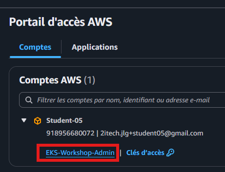
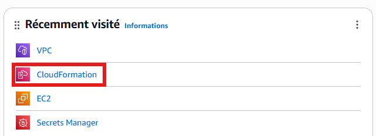
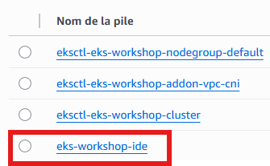
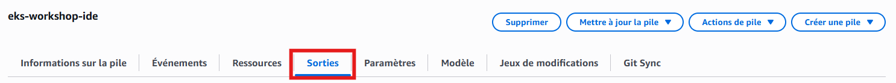
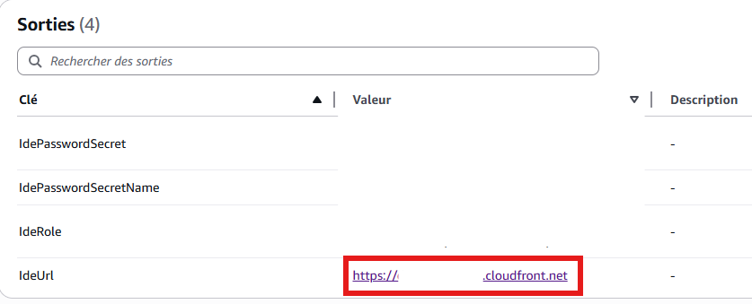
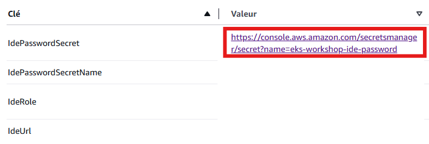
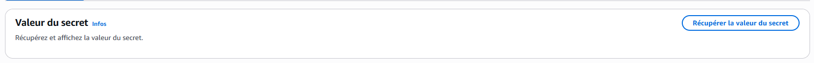
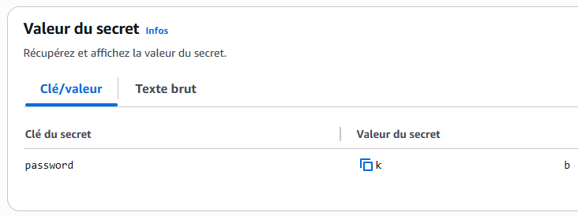

# Accès à la console

## Utiliser le lien de connection fournit par Jean-Louis dans son fichier .txt envoyé en privé

## S'y connecter avec son username (student-x) et son password

## Cliquer sur EKS-Workshop-Admin

## Cliquer sur CloudFormation

## Cliquer sur le lien de l'eks-workshop-ide

En cas d'abscence de ce lien, le créer en cliquant [ici](https://us-west-2.console.aws.amazon.com/cloudformation/home?region=us-west-2#/stacks/quickcreate?templateUrl=https://ws-assets-prod-iad-r-pdx-f3b3f9f1a7d6a3d0.s3.us-west-2.amazonaws.com/39146514-f6d5-41cb-86ef-359f9d2f7265/eks-workshop-vscode-cfn.yaml&stackName=eks-workshop-ide&param_RepositoryRef=stable).

## Aller sur l'onglet "Sorties"

## Cliquer sur l'url IdeUrl

## Le mot de passe demandé se trouve dans l'onglet "Sorties" avec le lien de "IdePasswordSecret" précédent sous la partie "Valeur du Secret"

## Pour l'afficher, cliquer sur "Récupérer la valeur du secret". ce secret peut être stocké dans un fichier txt car il ne change pas

