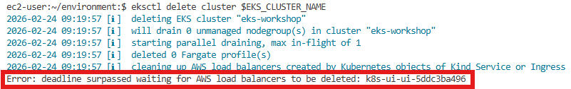
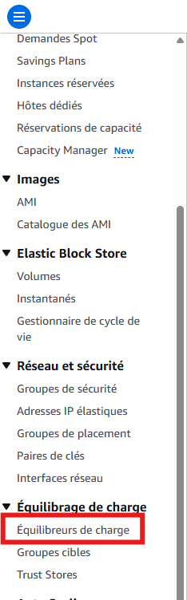
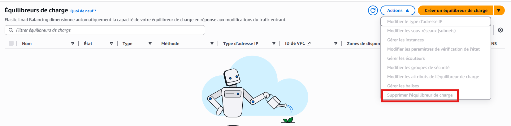
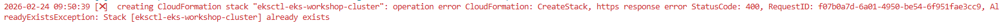
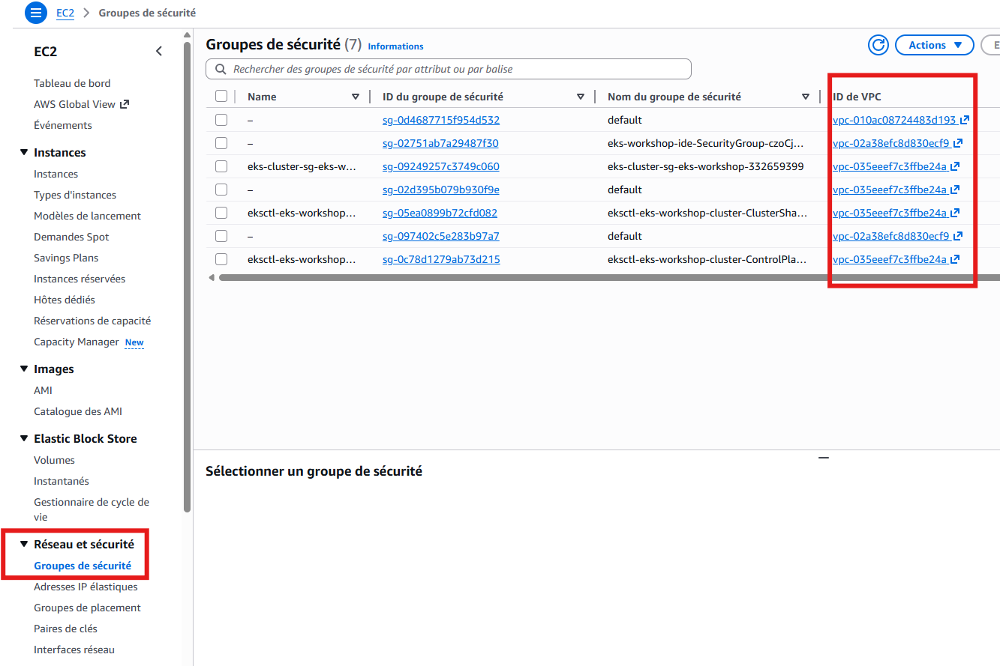
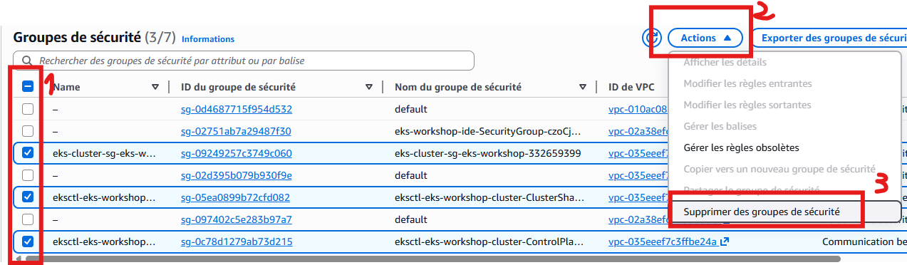

# Debug

Veuillez trouver ci-après les erreurs les plus fréquentes et la manière de les corriger en autonomie

## En cas d'erreur de suppression due au load balancer comme celle qui suit

Se rendre sur les LoadBalancer de l'EC2

Et le supprimer à la main

## Il se peut que cela soit insuffisant. On peut le voir avec une erreur à la recréation de la ressource du cluster

Dans ce cas, il va falloir vérifier les traces résiduelles liées à notre VPC ide comme les security group et les supprimer à la main le cas échéant

