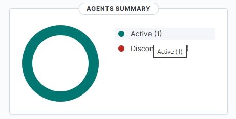
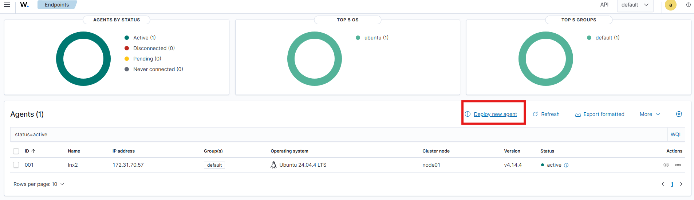

# Ajout d'un agent sur Wazuh

Pour ajouter l'agent, on va aller dans le AGENT SUMMARY en haut a gauche et cliquer sur "Active (0)"



On va clicker sur "Deploy new agent"



1. Cocher DEB amd64.
2. Mettre l'IP privée de l'EC2 Wazuh.
3. Mettre le nom de l'EC2 qu'on souhaite lier.
4. Copier la commande donnée.

Exécuter cette commande dans la console de l'instance EC2 de la VM qu'on souhaite monitorer.

Entrer les commandes suivantes :

```bat
sudo systemctl daemon-reload
```

```bat
sudo systemctl enable wazuh-agent
```

```bat
sudo systemctl start wazuh-agent
```

Retourner à la liste dess Agents et attendre.
Si vous n'avez pas fait d'erreur, tout devrait être bon.
