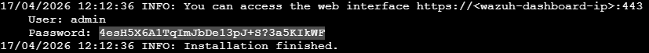

# Param EC2 Wazuh

## Paramètrage de l'instance en elle même

Se connecter sur la VM dans un premier temps et passer en sudo avec la commande

```bat
sudo su
```

Et envoyer la commande

```bat
curl -sO https://packages.wazuh.com/4.14/wazuh-install.sh && sudo bash ./wazuh-install.sh -a
```

La commande est longue à s'exécuter. Elle prompt un User et un password à la fin de son exécution.



On peut les utiliser en se connectant sur l'IP publique en https://{ip_public}

## Nous voici connecté sur Wazuh 🎉
